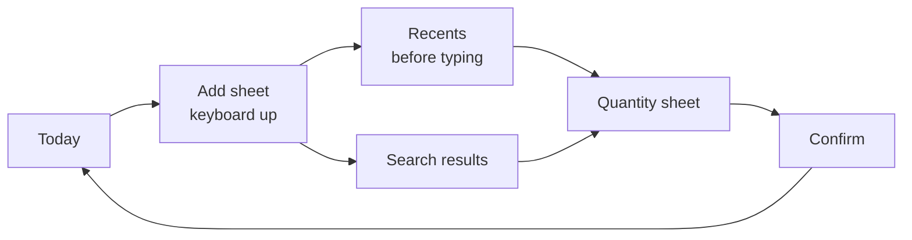

# Offline iOS Nutrition Tracker — Technical Plan

2026-09-21 · @Someone · revision 3

## Scope

A minimal iOS app whose only job is to be a good entry mask for Apple Health's nutrition data. It does not analyse, score or advise. It records what you ate and writes it to HealthKit.

The motivating target is the redesigned Health app's Longevity tab, which scores seven categories including nutrition. Nutrition is the one category no passive sensor can fill, so it is likely the emptiest input on most devices.

| Decision | Choice |
| --- | --- |
| Platform | iOS 26+, iPhone only; pure SwiftUI, Swift 6 language mode |
| Distribution | App Store, worldwide, paid upfront |
| Storage | Local only, no CloudKit, no account; schema kept CloudKit-compatible |
| Dependencies | None. No third-party packages in the app target |
| Nutrients | Energy, protein, carbohydrates, total fat, saturated fat, fiber, sugar, sodium |
| Food data | Bundled generic database from USDA FoodData Central; other sources when internationalizing |
| Barcodes | Opt-in; Open Food Facts online lookup with local cache |
| AI estimation | Opt-in; on-device Foundation Models |
| Recipes | Raw ingredient weights, no yield factors |

Both optional modules degrade to nothing. With no network and no Apple Intelligence, the app still logs food from the bundled database and writes it to Health. That is the load-bearing requirement.

Local-only storage means the SwiftData store rides along in iCloud Backup, so a device restore carries the log, but two devices never agree. Retrofitting CloudKit later is possible; the schema rules in the Local store section keep that retrofit to a configuration change rather than a migration. Nutrition history has a second life regardless, since HealthKit syncs across devices independently of this app; recipes and custom foods exist only here.

Paid upfront removes StoreKit entirely: no receipt validation, no entitlement gating, no free-tier flags. It also sets an expectation of completeness, which argues for spending real effort on bundled food coverage and search ranking rather than leaning on the scanner.

## Implementation stack and gating

Pure SwiftUI, Swift 6 language mode with strict concurrency on from the first commit. Deployment target iOS 26, which covers iPhone 11 and newer.

Nothing in this plan needs iOS 27 except the image-prompt call and the query for a time-limited Health authorization window, which is itself an iOS 27 feature. HealthKit correlations, sync identifiers, VisionKit scanning, SwiftData, Observation and text-only Foundation Models all exist on iOS 26, so availability checks appear in exactly two places.

### Project layout

A single checked-in Xcode project with folder-synchronised groups, no generator. Three targets: the app, a unit test bundle using Swift Testing, and nothing else in v1.

```
Omnomnom/            app target
  App/               entry point, tabs, environment
  Model/             SwiftData entities, snapshot maths
  FoodDB/            SQLite wrapper, search, portions
  Health/            HealthKit actor, reconciliation
  Features/          Today, Add, Quantity, Library, Settings
  Modules/           Barcode, Estimation (opt-in)
  Resources/         foods.sqlite, sources.json
OmnomnomTests/
Tools/fooddb/        Python pipeline that builds foods.sqlite
```

The HealthKit actor sits behind a protocol so the snapshot and reconciliation logic can be tested with a fake store. Nothing else needs mocking.

### Concurrency posture

Swift 6.2's approachable-concurrency settings matter here more than any individual API. Set default actor isolation to `@MainActor` for the app target: a single-user app driven by one person tapping a screen is overwhelmingly main-actor work, and opting in removes most annotation noise while leaving the genuinely concurrent parts explicit.

Mark the few things that must leave the main actor: FTS5 search over the bundled database, JSON decoding of Open Food Facts responses, and anchored-query reconciliation.

SwiftData background work goes through `@ModelActor`. Views use `@Query` directly.

HealthKit is the main friction point with strict concurrency. Its completion-handler APIs and the update handlers on `HKObserverQuery` and `HKAnchoredObjectQuery` fire off the main actor and are not Sendable-friendly. Wrap the entire HealthKit surface in one actor exposing an async API in your own value types, and never let an `HK` type reach a view.

### SwiftUI choices

`@Observable` rather than `ObservableObject`. `NavigationStack`, `.searchable` for the add sheet, `.presentationDetents` for the quantity sheet, `@Entry` for environment values. Liquid Glass needs no gating: adopt the system materials and let each OS render its own version.

### Where pure SwiftUI does not reach

Two unavoidable exceptions, both contained.

`DataScannerViewController` is UIKit, and there is no SwiftUI-native barcode scanner. It needs a `UIViewControllerRepresentable` wrapper of roughly forty lines, confined to the opt-in barcode module.

SwiftData cannot open a prebuilt read-only FTS5 database. The app opens `foods.sqlite` through the SQLite C API that ships with iOS, which includes FTS5, behind a thin Swift wrapper: open read-only, three prepared statements (FTS5 match, food by id, portions by food id), rows decoded into value types. Roughly a hundred lines, no third-party dependency. The wrapper is an actor so search runs off the main actor without further ceremony.

### Everything that needs gating

OS version is the least interesting gate. The AI feature alone has four independent runtime conditions that have nothing to do with iOS 27.

| Capability | Gate | Unavailable when |
| --- | --- | --- |
| Foundation Models image input | `#available(iOS 27, *)` | Device is on iOS 26 |
| Foundation Models at all | `SystemLanguageModel.default.availability` | Apple Intelligence off, unsupported device, unsupported region or language, model assets not yet downloaded |
| HealthKit | `HKHealthStore.isHealthDataAvailable()` | Never false on iPhone, still check |
| HealthKit write | Per-type authorization status | User declined that type; the other types are still written |
| HealthKit read | Not queryable by design | Always treat an empty result as empty, never as denied |
| Background delivery | `com.apple.developer.healthkit.background-delivery` entitlement | Entitlement missing; fails silently. No `UIBackgroundModes` entry is needed |
| Barcode scanner | `DataScannerViewController.isSupported` and `.isAvailable` | No Neural Engine, camera in use, or restricted |
| Camera | `AVCaptureDevice` authorization | User declined |
| Product lookup | Network reachability | Offline; falls back to manual entry |

### The iOS 26 consolation

Foundation Models exists on iOS 26, text-only; vision arrived in iOS 27. So the AI module degrades into two tiers rather than disappearing.

On iOS 27 the user photographs a plate. On iOS 26 the user types a description ("two scrambled eggs and a slice of rye toast") and gets the same `@Generable` struct back through the same draft-and-confirm screen. Same prompt scaffolding, same UI, different input. That is a better story than a feature that is simply missing on the older OS, and it costs one extra input path.

## Bundled food database

The app ships a read-only `foods.sqlite` built offline by a Python script in `Tools/fooddb/`. The app never generates or mutates it. The script is idempotent, takes the raw source downloads as input, and writes the database plus a `sources.json` attribution manifest that the Settings screen renders.

v1 bundles one source: USDA FoodData Central, Foundation Foods plus SR Legacy. It is CC0, English, analytically grounded, and around 9,000 generic foods, which removes cross-source deduplication from milestone 1 entirely. The pipeline is still written per source, with one mapping table each, so adding a second source later is a table and a dedup rule rather than a rewrite.

Only permissively licensed sources go in the bundle, now or later. Open Food Facts stays out, which keeps the shipped artifact free of share-alike obligations entirely.

| Source | Foods | Licence | Status |
| --- | --- | --- | --- |
| [FDC Foundation + SR Legacy](https://fdc.nal.usda.gov/) (USDA) | \~9,000 | CC0 1.0 | v1. Citation requested, not required |
| [CIQUAL 2025](https://ciqual.anses.fr/) (ANSES, France) | 3,484 | Licence Ouverte / Etalab | Internationalization. French names with an English edition |
| [BLS 4.0](https://www.blsdb.de/) (MRI, Germany) | 7,140 | CC BY 4.0, attribution to Max Rubner-Institut | Internationalization. German names, strong on composite dishes. Licence reported on GovData, confirm on the download page once |

After pruning to eight nutrients and removing the Foundation and SR Legacy overlap, expect roughly 8,000 rows, well under 5 MB including an FTS5 index.

### Schema

```
meta(key, value)                   -- schema_version, built_at, source versions, counts
foods(id, name, name_locale, source, source_ref, category,
      kcal_100g, protein_100g, carb_100g, fat_100g,
      satfat_100g, fiber_100g, sugar_100g, sodium_mg_100g,
      is_estimated, popularity)
foods_fts(name)                    -- FTS5 external content, unicode61, diacritics removed
portions(id, food_id, label, grams, seq)   -- "1 medium", "1 slice"
```

`id` is assigned by the build, never the source's own identifier; `source_ref` carries that. `kcal_100g` is the only nutrient that must be present, the rest are null when the source lacks them, never zero. `popularity` is the curated ranking boost. The `source` column exists for attribution, so the UI can name where a value came from. The full DDL lives in `Tools/fooddb/fooddb/schema.sql` and is the reference; this block is a summary.

### Column mapping

The pipeline reads one column per nutrient per source. These are the decisions; the first run verifies the identifiers against the downloaded files and the script fails loudly on a missing one.

| Nutrient | FDC nutrient id | Unit at source |
| --- | --- | --- |
| Energy | 1008 (kcal); fall back to 2047 Atwater General where 1008 is absent | kcal |
| Protein | 1003 | g |
| Carbohydrates | 1005 | g |
| Total fat | 1004 | g |
| Saturated fat | 1258 | g |
| Fiber | 1079 | g |
| Sugar | 2000 | g |
| Sodium | 1093 | mg |

FDC inputs are the Foundation Foods and SR Legacy CSV bundles: `food.csv`, `food_nutrient.csv`, `food_portion.csv` and `measure_unit.csv`. Portions come from `food_portion.csv`, which gives the gram weight of household measures like "1 medium" or "1 cup".

### Build-pipeline traps

A missing FDC value is null, never zero, and a food with a null energy is dropped. `is_estimated` exists for sources that publish markers such as `<` or `traces`; it stays false for every FDC row.

Units diverge against Open Food Facts: FDC and HealthKit report sodium in mg, OFF in grams. Normalise at build time, never at read time.

Overlap starts inside FDC: Foundation and SR Legacy describe many of the same foods. Prefer Foundation over SR Legacy on an identical description and drop the SR Legacy row. SR Legacy also carries a few hundred branded and restaurant items under generic descriptions; keep them, they are what people eat.

FDC descriptions are comma-inverted catalogue names, "Apples, raw, with skin", which search handles but which read badly in a list. Store the description as published and let ranking do the work rather than rewriting names by hand in v1.

Search ranking deserves more effort than raw FTS5 matching, since a paid app is judged on whether a normal day's eating can be logged without ever opening the scanner. First pass: FTS5 `bm25` weighted by a hand-curated frequency column for the few hundred most common foods, recents above everything.

## Local store

SwiftData, local-only, four entities.

| Entity | Holds |
| --- | --- |
| `Food` | A bundled reference by id, an Open Food Facts cache entry, or a user-created custom food |
| `Recipe` | Name, servings count |
| `RecipeIngredient` | Food reference plus grams |
| `LogEntry` | What, how much, timestamp, meal slot, frozen nutrition snapshot, HealthKit sync state |

The frozen snapshot on `LogEntry` is the important part. If a recipe is edited in March, February's logged dinners must not silently change, and HealthKit samples already written would otherwise drift out of step with the local store. Nutrition is computed at log time, stored on the entry, and the recipe is treated as a template rather than a live reference.

The bundled `foods.sqlite` is opened separately, read-only, outside SwiftData. Logging a bundled food copies its values into the entry snapshot, so a future database refresh never rewrites history.

### LogEntry sync state

```
id                UUID            sync identifier root
syncVersion       Int             bumped on every edit
writtenNutrients  Set<Nutrient>   samples this app last saved
presentNutrients  Set<Nutrient>   samples reconciliation last saw in Health
healthState       enum            derived, see Sync section
```

Per-nutrient sets rather than one flag, because the Health app deletes per sample.

### Schema rules for a later CloudKit retrofit

These cost nothing now and turn a future CloudKit switch into a container option instead of a migration.

- No `@Attribute(.unique)`. Uniqueness of `LogEntry.id` is enforced in code, not the schema.
- Every stored attribute is optional or has a default value.
- Every relationship is optional; inverses declared explicitly.
- No ordered relationships. `RecipeIngredient` carries its own `sortIndex`.
- The `Food` reference in `RecipeIngredient` and `LogEntry` is a relationship, not a foreign key string, so deletes cascade correctly.

## HealthKit write path

Each logged item becomes up to eight `HKQuantitySample`s wrapped in one `HKCorrelation` of type `.food`, with `HKMetadataKeyFoodType` set to the food or recipe name. The correlation is the structure HealthKit defines for food. Whether the Health app renders it as one named meal rather than eight nutrient rows is unverified and is a milestone 2 device check, not a UX promise.

| Nutrient | Identifier | Unit |
| --- | --- | --- |
| Energy | `dietaryEnergyConsumed` | kcal |
| Protein | `dietaryProtein` | g |
| Carbohydrates | `dietaryCarbohydrates` | g |
| Total fat | `dietaryFatTotal` | g |
| Saturated fat | `dietaryFatSaturated` | g |
| Fiber | `dietaryFiber` | g |
| Sugar | `dietarySugar` | g |
| Sodium | `dietarySodium` | mg |

### Identity across edits

Every object gets its own sync identifier, because HealthKit replaces any existing object carrying the same identifier regardless of type. Eight samples sharing one identifier would overwrite each other.

```
<entry uuid>.energy      dietaryEnergyConsumed sample
<entry uuid>.protein     ...
<entry uuid>.sodium
<entry uuid>.meal        the correlation
```

`HKMetadataKeySyncVersion` is set on all nine objects to `LogEntry.syncVersion`. Both keys must be present together. Re-saving with the same identifier and a higher version supersedes the previous object, and HealthKit documents that a replaced sample is also replaced inside its correlation. That gives edit-in-place without a delete-then-insert race.

### Partial authorization

The permission sheet lets the user decline individual types. The rule: write every authorized sample and skip the rest; create the correlation whenever at least one sample is authorized. `writtenNutrients` records what went out. A type the user grants later is picked up by the next edit, since an edit re-saves the whole set with a bumped version; older entries are not backfilled automatically.

### Authorization quirk

iOS reports write authorization but never read authorization, by design, so that an app cannot infer what a user chose to hide. Never branch on read status. Query, and treat an empty result as legitimately empty rather than as a permission problem.

Meal slot (breakfast, lunch, dinner, snack) has no standard HealthKit key. Store it in custom metadata on the correlation and keep the authoritative copy in the local store.

## Sync and reconciliation

True two-way sync is not available. HealthKit only permits an app to delete or modify samples it saved itself; samples written by the Health app or another app can be read but never touched. The workable model is that the local store is the source of truth and HealthKit holds a mirror of samples this app owns.

| Event | Handling |
| --- | --- |
| Edit in app | Re-save all authorized samples and the correlation with the same identifiers and a bumped version |
| Delete in app | One batched `HKHealthStore.delete` over the samples and the correlation; the batch is all-or-nothing |
| Delete in app after write permission was revoked | Not possible: HealthKit refuses deletes for types the user has revoked. Delete locally, mark the entry orphaned, show it once with a link to Settings |
| Delete of some nutrients in Health app | Detectable per sample: reconcile and offer to restore the missing samples or drop the entry |
| Delete of all nutrients in Health app | Same path, entry state is `gone` |
| Edit in Health app | Does not exist; Health offers only delete on third-party data |
| Foreign samples | Read-only. Shown in daily totals, visually distinct, not editable |
| Samples from this app on another device | Foreign. Same bundle identifier, no local row, so they count once as foreign and are labelled as coming from this app on another device |

"Own" means mirrored by a local entry: a sample counts as this app's only when its sync identifier parses and the entry exists locally. Bundle identifier alone is neither necessary nor sufficient, since Health syncs this app's samples from other devices and a removed orphaned entry leaves samples behind. Anything not mirrored is foreign, which keeps every sample counted exactly once.

A read from a missing anchor returns only objects that still exist, so deletions older than the first anchor are never reported. Reconciliation treats a complete read from no anchor as authoritative: every written nutrient not seen in that read is marked absent.

Deleting a correlation is not documented to delete its contained samples, and in practice it does not. Always delete the samples explicitly alongside the correlation. This is one of the milestone 2 device checks.

### Entry health state

Derived from the two sets on `LogEntry`, never stored separately.

| State | Condition |
| --- | --- |
| `synced` | present equals written |
| `partial` | present is a non-empty strict subset of written |
| `gone` | present is empty, written is not |
| `unauthorized` | written is empty because no type was authorized |
| `orphaned` | local delete could not be mirrored |

### Detecting outside deletions

An `HKObserverQuery` per quantity type with background delivery enabled wakes the app. An `HKAnchoredObjectQuery` per type then returns `deletedObjects`, each carrying its metadata including the sync identifier, which maps straight back to an entry and a nutrient. No sample UUIDs need to be stored locally. Nine anchors are persisted, one per type plus the correlation type.

Deleted-object records are temporary and HealthKit purges them to save space, so the anchored queries run on every wake and at every launch, never only on demand.

Launch renders local state immediately and reconciles asynchronously, patching entries as results arrive. Blocking first paint on nine HealthKit queries is not acceptable on a large store.

When an entry's samples are gone or partial, mark it and offer one tap to restore the missing samples or to delete it locally too. Silent re-pushing is wrong: the user deleted it deliberately.

Background delivery is the one reason this app needs the background-delivery entitlement despite having no widgets or Watch target.

## Recipes

A recipe is a list of ingredient rows, each a food reference plus a raw gram weight, and a servings count.

```
total_weight   = sum of raw ingredient grams
total_nutrient = sum of (grams / 100) x nutrient_per_100g
per_serving    = total_nutrient / servings
```

Logging asks for a serving count and accepts fractions. The logged entry stores the resulting numbers, not a pointer to the recipe.

No yield factors and no cooked-weight correction. Nutrients are conserved through cooking even though weight is not, so summing raw ingredients is correct for the whole dish. What it cannot do is tell you what a 200 g cooked portion contains.

That limitation needs one line of UI where servings are entered: servings are portions of the raw total. Without it, someone weighs their cooked plate and expects the number to mean something.

No nested recipes in v1. A recipe that uses another recipe as an ingredient is a reasonable later addition but doubles the snapshot logic.


The snapshot at `LogEntry` is where the chain is deliberately cut: everything downstream of it is immutable history.

## UI and UX

One principle decides every trade-off below: this is an entry mask, and the cost of logging is the whole product. An app that is pleasant but takes twenty seconds per item gets abandoned in a week, and an empty nutrition history is worth nothing to the Longevity tab.

The targets to design against: a repeat meal in under five seconds and three taps; a food never logged before in under twenty seconds.

### Screens

| Screen | Purpose |
| --- | --- |
| Today | Default. Date, daily totals, entries grouped by meal slot, add button |
| Add | Modal search over bundled foods, recent items, recipes; routes to quantity |
| Quantity | Gram field, portion chips, live nutrition preview, confirm |
| Library | Foods and recipes, custom food creation, recipe builder |
| Settings | Health status, opt-in toggles, sources and attribution |

Three tabs, no more. Add and Quantity are sheets over Today, not tab destinations.

### The fast path



The add sheet opens with the keyboard already up and, crucially, with recent and frequent items listed **before any typing**. Most logging is repetition, so the common case should never involve a search at all.

Every entry on Today carries a repeat action on swipe or long-press, which re-logs the same food and quantity at the current time. A "copy yesterday" affordance on an empty day covers the routine eater.

The quantity sheet prefills the last amount used for that food. For a person who eats 40 g of oats every morning, logging becomes: tap add, tap oats, tap confirm.

### Quantity entry

Grams are canonical. Portion chips from the `portions` table sit above the field as shortcuts ("1 medium, 182 g"), and tapping one fills the gram value rather than switching units, so the user always sees what was actually recorded.

Number pad by default. Nutrition preview updates live as digits are typed, which catches decimal-place mistakes before they reach Health.

Timestamp defaults to now, with the meal slot inferred from time of day and editable. Logging into the past is one tap on the date header, not a buried date picker.

### Daily totals

Energy, protein, carbohydrates and fat get primary weight. Fiber, sugar, saturated fat and sodium sit in a secondary row. All eight are always visible; none are hidden behind a tap.

No colour-coded judgment, no over/under indicators, no traffic lights. That is interpretation, it is what the Health app now does, and it is the behaviour that drifts toward the MDR boundary described below. Totals are reported, not graded.

Optional user-set reference targets are a plausible later addition, off by default and rendered as a neutral line rather than a verdict. Worth deciding explicitly rather than by drift.

### Provenance in the UI

Entries this app wrote are editable and swipeable. Samples read from HealthKit that another source wrote appear in totals but are visually distinct, labelled with their source, and carry no edit affordance, because HealthKit will not permit one.

An entry in the `partial` or `gone` state needs its own visible treatment on Today, naming which nutrients Health no longer has, with one tap to restore them and one to remove the entry locally. An `unauthorized` entry shows once that nothing reached Health, with a link to Settings. Silent behaviour in any direction is wrong.

### Recipe builder

Ingredient rows with inline gram fields, a running total weight, and a servings stepper. Per-serving nutrition updates live beneath.

Editing an existing recipe shows one line confirming that previously logged servings are unchanged, since that is surprising behaviour if it is not stated.

The servings control carries the raw-weight caveat from the Recipes section. It belongs at the point of entry, not in a help screen.

### Permissions, onboarding and empty states

The HealthKit permission sheet can only be shown once per type, so it must be preceded by a plain-language screen explaining what is written and why. If permission is refused for some or all types, the app continues to work as a local log, writes whatever was allowed, and offers a route to Settings, never a dead end.

Onboarding is two screens: what the app does, then the permission primer. The barcode and AI modules are introduced in context at the moment they would help, not in a carousel up front.

First-run Today shows a single prompt to log one thing. First-run Library shows the bundled database is already there, since "works offline out of the box" is the paid app's main promise and should be visible immediately.

### Accessibility

Dynamic Type throughout, including the totals row, which is the layout most likely to break at large sizes. VoiceOver labels on the quantity field must read the unit. The primary interactions should be reachable one-handed at the bottom of the screen, since food logging happens while holding a fork.

### Deliberately absent

No streaks, badges, or gamification. No social features. No trend charts or history graphs, which the Health app already does better and which would duplicate data the app does not own. No coaching, scoring or recommendations.

The omissions are not only taste. They keep the app on the logging-tool side of the medical-device line and keep the surface small enough that the fast path stays fast.

## Opt-in modules

Both are off until the user turns them on, and the app is complete without either.

### Barcode scanning

Detection runs on-device through VisionKit's `DataScannerViewController`, so the scan itself needs no network. The lookup does.

Query `https://world.openfoodfacts.org/api/v2/product/{barcode}.json` and cache the result locally and permanently. Send a descriptive `User-Agent` carrying the app name and a contact URL; Open Food Facts asks for this and rate-limits requests without one.

Request only the eight nutrient fields plus product name and brand. Note that Open Food Facts reports sodium in grams, and many products carry `salt_100g` instead, which is not the same number: sodium is salt divided by 2.5.

Misses and half-empty records are common, so a "not found, add manually" path is a requirement rather than a nicety. A local cache is never publicly used, so share-alike is not triggered; attribution still is.

If the app ever lets users correct product data, push those corrections back to Open Food Facts.

### AI photo estimation

The on-device Foundation Models language model gained vision in iOS 27: an image is attached to the prompt alongside the text, with no separate vision pipeline and no model switch. Combined with the `@Generable` macro to request a typed Swift struct, a photo yields a structured macro estimate entirely on-device, with no network, no key and no per-token cost.

On iOS 26 the same model exists without vision, so the module degrades to a typed description rather than disappearing. See the implementation section for how the two tiers share one prompt and one confirmation screen.

Gate on `SystemLanguageModel.default.availability` before `#available(iOS 27, *)`, in that order: a device on iOS 27 with Apple Intelligence disabled fails the first check, and the availability reason is what the UI should explain.

The result lands in an editable draft the user confirms. An estimate is never written to HealthKit automatically.

## Licensing and compliance

Not legal advice; this is a map of what to verify.

### Why share-alike never applies here

The [ODbL](https://opendatacommons.org/licenses/odbl/summary/) imposes attribution, share-alike and keep-open, with no non-commercial restriction, so selling an app built on Open Food Facts is explicitly permitted. Share-alike attaches to a derivative database that is made available to others, and keep-open means a DRM-restricted copy must be matched by an unrestricted one. Bundling an Open Food Facts subset would trigger both; querying it online and caching privately triggers neither, because a private cache is not publicly used.

With the v1 bundle limited to CC0 data, nothing shipped carries any obligation at all. The later sources add attribution and nothing more.

Keep the bundled tables physically separate from anything Open Food Facts derived. Merging ODbL data into the generic table would spread share-alike across the merged whole.

### Attribution

A Sources screen naming every database, its licence and a link, rendered from the `sources.json` the pipeline emits so the two never drift. USDA asks for a citation; give it even though CC0 does not require it. Open Food Facts additionally asks for attribution on product screens sourced from them, with clickable links to the site and the licence, and maintains a public non-compliance list worth checking against. BLS, when added, requires naming the Max Rubner-Institut as publisher.

Skip Open Food Facts product images entirely: they are CC BY-SA and may carry packaging artwork and trademark rights beyond the photo itself.

### Privacy and regulatory

No data leaves the device except barcode lookups to Open Food Facts, which is French-hosted. That keeps the GDPR position short and the App Store privacy labels nearly empty. Fill in the privacy manifest to match.

Position the app strictly as a logging tool with no interpretation, scores or recommendations. That keeps it clear of the EU MDR boundary for software as a medical device, which the longevity framing could otherwise drift toward.

Apple forbids using HealthKit data for advertising, which is moot here but is asked at review. HealthKit usage descriptions must be specific about why each permission is needed.

Review will open the app on a device that may have no network and no Apple Intelligence. Test that path in airplane mode with Apple Intelligence disabled before submitting.

## Build order

Ordered by dependency, not by visibility. The first two milestones carry the most risk.

1. **Data pipeline.** A standalone script producing `foods.sqlite` and `sources.json` from FDC. No app code. Single source, so the risk is the FDC file format and the Foundation versus SR Legacy overlap, not cross-source deduplication.
2. **Log to Health end-to-end.** Search a bundled food, enter grams, write the food correlation, see it in the Health app. Proves the write path and the correlation grouping. Ends with the device checks below.
3. **Reconciliation.** Observer queries, anchored queries, per-sample deletion handling, restore affordance. Tedious to retrofit once entries exist, so it comes before features.
4. **Recipes.** Ingredient rows, servings, snapshot on log.
5. **Barcode.** Scanner, lookup, cache, attribution, manual fallback.
6. **AI estimation.** Availability gate, image prompt, generable struct, editable draft.
7. **Internationalization.** Localised UI, then CIQUAL and BLS as second and third bundled sources with the user's language ranked first in search, and cross-source deduplication by one primary source per food group.

Steps 1 to 4 are the shippable app. Steps 5 to 7 are additive and can slip without blocking a release.

### Internationalization notes

Kept here so the v1 pipeline does not paint itself into a corner.

- `name_locale` is populated from day one, `en` for every FDC row, so search can filter or rank by language later without a schema change.
- `source` and `source_ref` stay per row, so a later source never overwrites an FDC row's provenance.
- CIQUAL publishes values as strings with markers such as `<` and `traces`; map both to zero and set `is_estimated`. CIQUAL reports sodium in mg.
- CIQUAL constituent codes for the eight nutrients: energy 328 (EU Regulation 1169/2011 kcal), protein 25000, carbohydrates 31000, fat 40000, saturated fat 40302, fiber 34100, sugar 32000, sodium 10110. Verify against the 2025 file on first use.
- Cross-source overlap, CIQUAL's "Pomme, pulpe, crue" against FDC's "Apples, raw, with skin", is handled at build time by picking one primary source per food group, never at runtime.

### Milestone 2 device checks

Each is a behaviour this plan assumes but Apple does not document. Run them on a real device before milestone 3 starts, and record the outcome here.

- Re-saving nine objects with bumped sync versions replaces them in place and leaves exactly one correlation.
- Deleting the correlation alone leaves the samples behind, so the batched delete is required.
- Deleting one nutrient in the Health app surfaces one deleted object with the expected sync identifier in its metadata.
- Background delivery for dietary types fires at `.immediate`, or note the actual minimum frequency.
- How the Health app displays the food correlation, and whether `HKMetadataKeyFoodType` appears anywhere a user can see.
- A partial authorization set (energy denied, the rest allowed) produces a correlation that Health accepts.

## Open risks

**The Longevity target is partly invisible.** Apple has not documented which nutrient types the Longevity nutrition category consumes. The redesigned Health app entered the iOS 27.2 developer beta on 16 September 2026, excluded from the initial public release, with a broader rollout later in 2026 in US English only. Writing the full eight-nutrient set with proper food correlations is the best available hedge; revisit once the feature ships publicly.

**Health app rendering of correlations is unverified.** The correlation is the right structure to write regardless, but no UX copy may promise a "meal" in Health until the milestone 2 check confirms it.

**Apple Intelligence availability varies.** Region, device and OS gating means the photo tier will be unavailable for a large share of a worldwide audience: everyone on iOS 26, everyone without a supported device, and everyone in a region or language Apple Intelligence does not yet cover. The text tier narrows this but does not close it. The module must read as optional rather than broken, and the UI should name the actual reason rather than hiding the feature.

**The v1 bundle is English only and US-shaped.** FDC covers generic foods well but is thin on European composite dishes, and a German or French user searching in their own language finds nothing in the bundle until milestone 7. Acceptable for an English-first launch; it is the reason the app should not be marketed outside English-speaking storefronts before then.

**Nutrient identifiers are unverified against the current FDC files.** The column mapping table is from the published FDC identifier list; the pipeline's first run confirms it and fails loudly otherwise.

**Cross-source overlap is deferred with milestone 7.** The size of the CIQUAL and FDC duplicate set is not knowable in advance. If the primary-source-per-group rule produces poor coverage, the fallback is manual curation of the top few hundred foods, which is a day of work rather than a redesign.

**Open Food Facts data quality is uneven.** Crowdsourced records vary by market and completeness. The manual-entry fallback is what keeps that from becoming a user-facing failure.

## Sources

- [Open Food Facts data and reuse conditions](https://world.openfoodfacts.org/data)
- [Open Food Facts terms of use](https://world.openfoodfacts.org/terms-of-use)
- [ODbL 1.0 summary](https://opendatacommons.org/licenses/odbl/summary/)
- [OpenStreetMap Foundation licence FAQ](https://osmfoundation.org/wiki/Licence/Licence_and_Legal_FAQ) — derivative database versus produced work
- [CIQUAL 2025](https://entrepot.recherche.data.gouv.fr/dataset.xhtml?persistentId=doi%3A10.57745%2FRDMHWY)
- [FoodData Central API guide](https://fdc.nal.usda.gov/api-guide) — CC0 licensing
- [BLS 4.0 on GovData](https://www.govdata.de/suche/daten/bundeslebensmittelschlussel-bls-version-4-0-deutsche-nahrstoffdatenbank?ids=93533564-6f65-4dfc-b435-43a92421ccc4) — CC BY 4.0
- [BLS 4.0 released free of charge](https://heise.de/-11123877)
- [HKMetadataKeySyncIdentifier](https://developer.apple.com/documentation/healthkit/hkmetadatakeysyncidentifier) — replacement semantics
- [HKHealthStore delete(_:withCompletion:)](https://developer.apple.com/documentation/healthkit/hkhealthstore) — revoked permission, all-or-nothing batch
- [HKDeletedObject](https://developer.apple.com/documentation/healthkit/hkdeletedobject) — deleted records are temporary
- [HealthKit background delivery entitlement](https://developer.apple.com/documentation/bundleresources/entitlements/com.apple.developer.healthkit.background-delivery)
- [Apple Newsroom: redesigned Health app and Longevity](https://www.apple.com/newsroom/2026/09/apple-advances-health-and-fitness-capabilities-using-apple-intelligence/)
- [iOS 27.2 beta Health app details](https://www.macrumors.com/2026/09/16/ios-27-2-beta-health-app/)
- [What's new in the Foundation Models framework, WWDC 2026](https://developer.apple.com/videos/play/wwdc2026/241)
