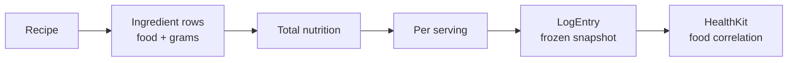
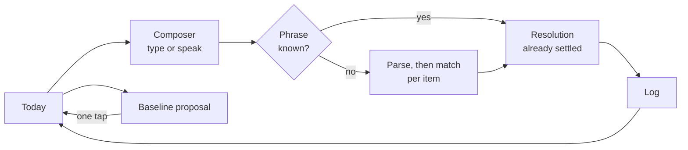

# Offline iOS Nutrition Tracker — Technical Plan

2026-10-03 · @Someone · revision 4

## Scope

A minimal iOS app with two jobs: be the cheapest possible way to record what you ate, and show what that adds up to over time. It does not score or advise. It records, it reports, and it writes everything to HealthKit.

Revision 4 is a rethink of the first job and a reversal on the second. Revisions 1 to 3 built an entry mask around gram-accurate per-food entry: a search screen, a gram field and eight nutrients per item. That is a precision instrument, and the precision is paid for at every meal and never collected, because the question being asked of the data is a broad-strokes trend over months. The target resolution is now stated explicitly, and most of what follows is a consequence of it.

> Day-level totals, accurate to roughly ±15 to 20 per cent, read as a seven-day rolling mean over months. Never meal-level accuracy.

Against that target a gram field is over-specification, a per-item confirmation screen is a toll, and an unlogged day is normal rather than a failure. Approximate and complete beats precise and abandoned, for the user's own question and for the Longevity target below: an estimated kilocalorie is still a kilocalorie to that tab, and an empty history is worth nothing to it.

The motivating target is the redesigned Health app's Longevity tab, which scores seven categories including nutrition. Nutrition is the one category no passive sensor can fill, so it is likely the emptiest input on most devices.

| Decision | Choice |
| --- | --- |
| Platform | iOS and iPadOS 26+; pure SwiftUI, Swift 6 language mode |
| Distribution | App Store, worldwide, paid upfront |
| Storage | Local only, no CloudKit, no account; schema kept CloudKit-compatible |
| Dependencies | None. No third-party packages in the app target |
| Nutrients | Eight written to Health; energy, protein and fiber are the headline in the app |
| Food data | Bundled generic database from Ciqual and the Bundeslebensmittelschlüssel; FDC readable but not built in |
| Products | Opt-in; Open Food Facts looked up by barcode or searched by name, cached locally |
| Visual search | The app's foods appear in the system's visual intelligence results; nothing leaves the device |
| Input | One line of text or speech is the primary path; search, barcode and photo all remain |
| Amounts | Portion buckets against the last amount; grams canonical underneath and still reachable |
| Trends | In scope as of revision 4: energy, protein and fiber over time, plus data coverage |
| On-device AI | Core path, not a module: parses the line and checks each match. Degrades to a deterministic parser and a build-time flag |
| AI estimation | The photo tier only, opt-in; same model, same prompt, same matcher |
| Meals | Saved from what was parsed or logged, not built by weighing; `Recipe` in the schema |

Both optional modules degrade to nothing. With no network and no Apple Intelligence, the app still logs food from the bundled database and writes it to Health. That is the load-bearing requirement.

Local-only storage means the SwiftData store rides along in iCloud Backup, so a device restore carries the log, but two devices never agree. Retrofitting CloudKit later is possible; the schema rules in the Local store section keep that retrofit to a configuration change rather than a migration. Nutrition history has a second life regardless, since HealthKit syncs across devices independently of this app; recipes and custom foods exist only here.

Paid upfront removes StoreKit entirely: no receipt validation, no entitlement gating, no free-tier flags. It also sets an expectation of completeness, which argues for spending real effort on bundled food coverage and search ranking rather than leaning on the scanner.

## Implementation stack and gating

Pure SwiftUI, Swift 6 language mode with strict concurrency on from the first commit. Deployment target iOS 26, which covers iPhone 11 and newer.

Universal: one target, both device families. The iPhone stays portrait, because logging a meal is a one-handed job done standing up; the iPad takes all four orientations, which multitasking requires. Not macOS, and not for want of trying — HealthKit is not supported there and `isHealthDataAvailable()` returns false, so the half of this app that matters cannot run. The app would degrade cleanly into a local food log, which is not the app.

Nothing in this plan needs iOS 27 except the image-prompt call and the query for a time-limited Health authorization window, which is itself an iOS 27 feature. HealthKit correlations, sync identifiers, VisionKit scanning, SwiftData, Observation and text-only Foundation Models all exist on iOS 26, so availability checks appear in exactly two places.

### Project layout

A single checked-in Xcode project with folder-synchronised groups, no generator. Three targets: the app, a unit test bundle using Swift Testing, and nothing else in v1.

```
Omnomnom/            app target
  App/               entry point, tabs, environment
  Model/             SwiftData entities, snapshot maths
  FoodDB/            SQLite wrapper, search, portions
  Health/            HealthKit actor, reconciliation
  Features/          Today, Add, Quantity, Library, Settings
  Modules/           Barcode, Estimation (opt-in)
  Resources/         foods.sqlite, sources.json
OmnomnomTests/
Tools/fooddb/        Python pipeline that builds foods.sqlite
```

The HealthKit actor sits behind a protocol so the snapshot and reconciliation logic can be tested with a fake store. Nothing else needs mocking.

### Concurrency posture

Swift 6.2's approachable-concurrency settings matter here more than any individual API. Set default actor isolation to `@MainActor` for the app target: a single-user app driven by one person tapping a screen is overwhelmingly main-actor work, and opting in removes most annotation noise while leaving the genuinely concurrent parts explicit.

Mark the few things that must leave the main actor: FTS5 search over the bundled database, JSON decoding of Open Food Facts responses, and anchored-query reconciliation.

SwiftData background work goes through `@ModelActor`. Views use `@Query` directly.

HealthKit is the main friction point with strict concurrency. Its completion-handler APIs and the update handlers on `HKObserverQuery` and `HKAnchoredObjectQuery` fire off the main actor and are not Sendable-friendly. Wrap the entire HealthKit surface in one actor exposing an async API in your own value types, and never let an `HK` type reach a view.

### SwiftUI choices

`@Observable` rather than `ObservableObject`. `NavigationStack`, `.searchable` for the add sheet, `.presentationDetents` for the quantity sheet, `@Entry` for environment values. Liquid Glass needs no gating: adopt the system materials and let each OS render its own version.

### Where pure SwiftUI does not reach

Two unavoidable exceptions, both contained.

`DataScannerViewController` is UIKit, and there is no SwiftUI-native barcode scanner. It needs a `UIViewControllerRepresentable` wrapper of roughly forty lines, confined to the opt-in barcode module.

SwiftData cannot open a prebuilt read-only FTS5 database. The app opens `foods.sqlite` through the SQLite C API that ships with iOS, which includes FTS5, behind a thin Swift wrapper: open read-only, three prepared statements (FTS5 match, food by id, portions by food id), rows decoded into value types. Roughly a hundred lines, no third-party dependency. The wrapper is an actor so search runs off the main actor without further ceremony.

### Everything that needs gating

OS version is the least interesting gate. The AI feature alone has four independent runtime conditions that have nothing to do with iOS 27.

| Capability | Gate | Unavailable when |
| --- | --- | --- |
| Foundation Models image input | `#available(iOS 27, *)` | Device is on iOS 26 |
| Foundation Models at all | `SystemLanguageModel.default.availability` | Apple Intelligence off, unsupported device, unsupported region or language, model assets not yet downloaded |
| HealthKit | `HKHealthStore.isHealthDataAvailable()` | Never false on an iPhone or an iPad since iPadOS 17, still check; false on macOS, which is why there is no Mac app |
| HealthKit write | Per-type authorization status | User declined that type; the other types are still written |
| HealthKit read | Not queryable by design | Always treat an empty result as empty, never as denied |
| Background delivery | `com.apple.developer.healthkit.background-delivery` entitlement | Entitlement missing; fails silently. No `UIBackgroundModes` entry is needed |
| Barcode scanner | `DataScannerViewController.isSupported` and `.isAvailable` | No Neural Engine, camera in use, or restricted |
| Camera | `AVCaptureDevice` authorization | User declined |
| Product lookup | Network reachability | Offline; falls back to manual entry |

### The iOS 26 consolation

Foundation Models exists on iOS 26, text-only; vision arrived in iOS 27. So the AI module degrades into two tiers rather than disappearing.

On iOS 27 the user photographs a plate. On iOS 26 the user types a description ("two scrambled eggs and a slice of rye toast") and gets the same `@Generable` struct back through the same draft-and-confirm screen. Same prompt scaffolding, same UI, different input. That is a better story than a feature that is simply missing on the older OS, and it costs one extra input path.

## Bundled food database

The app ships a read-only `foods.sqlite` built offline by a Python script in `Tools/fooddb/`. The app never generates or mutates it. The script is idempotent, takes the raw source downloads as input, and writes the database plus a `sources.json` attribution manifest that the Settings screen renders.

The bundle is built from Ciqual and the BLS: two European tables of generic foods, analytically measured, that between them describe what is eaten here. FDC remains readable and tested, and is left out of the build because its names are US-shaped and its composite dishes are not the ones on a European plate. It is one flag away from coming back.

Only permissively licensed sources go in the bundle, now or later. Open Food Facts stays out, which keeps the shipped artifact free of share-alike obligations entirely — and is why no branded product is in the bundle, since a generic composition table has never held one.

| Source | Foods | Licence | Status |
| --- | --- | --- | --- |
| [Ciqual](https://ciqual.anses.fr/) (ANSES, France) | 3,484 | Licence Ouverte / Etalab | Bundled. French and English names, both indexed |
| [BLS 4.0](https://www.blsdb.de/) (MRI, Germany) | 7,140 | CC BY 4.0, attribution to Max Rubner-Institut | Bundled. German and English names, both indexed; strong on composite dishes |
| [FDC Foundation + SR Legacy](https://fdc.nal.usda.gov/) (USDA) | \~9,000 | CC0 1.0 | Readable, not built in. Citation requested, not required |

Expect roughly 10,000 rows, well under 5 MB including an FTS5 index.

A source is named on the command line, so which ones ship is a build decision rather than a code change: `--ciqual`, `--bls`, `--fdc`, any combination, at least one.

### Schema

```
meta(key, value)                   -- schema_version, built_at, source versions, counts
foods(id, name, name_locale, alt_names, source, source_ref, category,
      kcal_100g, protein_100g, carb_100g, fat_100g,
      satfat_100g, fiber_100g, sugar_100g, sodium_mg_100g,
      is_estimated, is_ingredient, popularity)
foods_fts(name, alt_names)         -- FTS5 external content, unicode61, diacritics removed
portions(id, food_id, label, grams, seq)   -- "1 medium", "1 slice"
```

`is_ingredient` marks a row that is an ingredient or a dry, raw or concentrated form rather than a portion anyone eats, which is what keeps a 200 g serving of coffee powder from being auto-matched to the word "coffee"; see the validation section for the three defences it is the first of. `alt_names` holds the same food's names in the source's other languages, newline separated, indexed for search and never displayed: typing "pomme" finds the row that reads "Apple, pulp and skin, raw", and typing "Apfel" finds "Apfel roh". `id` is assigned by the build, never the source's own identifier; `source_ref` carries that. `kcal_100g` is the only nutrient that must be present, the rest are null when the source lacks them, never zero. `popularity` is the curated ranking boost. The `source` column exists for attribution, so the UI can name where a value came from. The full DDL lives in `Tools/fooddb/fooddb/schema.sql` and is the reference; this block is a summary.

### Column mapping

The pipeline reads one column per nutrient per source. These are the decisions; every build verifies the identifiers against the downloaded files and fails loudly on a missing one. `python3 -m fooddb inspect <folder>` prints what a download actually contains, which is how a renamed column is diagnosed rather than guessed at.

Ciqual is keyed by constituent code, and the unit is written into the constituent's own name, so a renumbering or a unit change fails the build: energy 328 (kcal), protein 25000, carbohydrates 31000, fat 40000, saturated fat 40302, fibre 34100, sugars 32000, sodium 10110 (mg).

The BLS is one wide table with three columns per component — the value, where it came from, and its reference — and every value column states its own unit in its header, as in `NA Natrium [mg/100g]`. Columns are matched on the component code alone, which is the part of a header that does not move and the part that tells a value apart from its provenance, since only a value carries a unit. The unit is then read rather than assumed and converted by a stated factor; a component published in a unit the pipeline does not know stops the build. Codes read: energy ENERCC (kcal), protein PROT625, carbohydrates CHO, fat FAT, saturated fat FASAT, fibre FIBT, sugars SUGAR, sodium NA (mg).

| Nutrient | FDC nutrient id | Unit at source |
| --- | --- | --- |
| Energy | 1008 (kcal); fall back to 2047 Atwater General where 1008 is absent | kcal |
| Protein | 1003 | g |
| Carbohydrates | 1005 | g |
| Total fat | 1004 | g |
| Saturated fat | 1258 | g |
| Fiber | 1079 | g |
| Sugar | 2000 | g |
| Sodium | 1093 | mg |

FDC inputs are the Foundation Foods and SR Legacy CSV bundles: `food.csv`, `food_nutrient.csv`, `food_portion.csv` and `measure_unit.csv`. Portions come from `food_portion.csv`, which gives the gram weight of household measures like "1 medium" or "1 cup".

### Build-pipeline traps

A missing FDC value is null, never zero, and a food with a null energy is dropped. `is_estimated` exists for sources that publish markers such as `<` or `traces`; it stays false for every FDC row.

Units diverge against Open Food Facts: FDC and HealthKit report sodium in mg, OFF in grams. Normalise at build time, never at read time.

Overlap starts inside FDC: Foundation and SR Legacy describe many of the same foods. Prefer Foundation over SR Legacy on an identical description and drop the SR Legacy row. SR Legacy also carries a few hundred branded and restaurant items under generic descriptions; keep them, they are what people eat.

FDC descriptions are comma-inverted catalogue names, "Apples, raw, with skin", which search handles but which read badly in a list. Store the description as published and let ranking do the work rather than rewriting names by hand in v1.

Search ranking deserves more effort than raw FTS5 matching, since a paid app is judged on whether a normal day's eating can be logged without ever opening the scanner. First pass: FTS5 `bm25` weighted by a hand-curated frequency column for the few hundred most common foods, recents above everything.

## Local store

SwiftData, local-only. `Tag` and `Photo` joined the four original entities; revision 4 adds four more, all for memory and coverage.

| Entity | Holds |
| --- | --- |
| `Food` | A bundled reference by id, an Open Food Facts cache entry, or a user-created custom food |
| `Recipe` | Name, servings count. A batch dish, no longer the mechanism for repetition |
| `RecipeIngredient` | Food reference plus grams |
| `LogEntry` | What, how much, timestamp, meal slot, frozen nutrition snapshot, HealthKit sync state, `origin` |
| `Phrase` | A normalised typed line, and what it resolved to last time |
| `PhraseItem` | One food reference plus an amount, with a `sortIndex` |
| `BaselinePhrase` | A phrase the user eats by default, plus its meal slot |
| `DayRecord` | One date: marked complete, and in the sample |

`LogEntry.origin` is new and says how the entry came to exist: typed, dictated, photographed, picked from search, repeated, or accepted from the baseline. It is display and coverage information, never behaviour — nothing branches on it in the write path — and it is what lets an accepted baseline day stay distinguishable from a typed one a month later.

`Phrase` is the memory the natural-language path runs on, and it obeys the same CloudKit rules as everything else: no unique attribute, so a normalised string is resolved case-insensitively in code at write time, exactly as `Tag` names already are. `PhraseItem` carries its own `sortIndex` rather than relying on an ordered relationship.

The frozen snapshot on `LogEntry` is the important part. If a recipe is edited in March, February's logged dinners must not silently change, and HealthKit samples already written would otherwise drift out of step with the local store. Nutrition is computed at log time, stored on the entry, and the recipe is treated as a template rather than a live reference.

The bundled `foods.sqlite` is opened separately, read-only, outside SwiftData. Logging a bundled food copies its values into the entry snapshot, so a future database refresh never rewrites history.

### LogEntry sync state

```
id                UUID            sync identifier root
syncVersion       Int             bumped on every edit
writtenNutrients  Set<Nutrient>   samples this app last saved
presentNutrients  Set<Nutrient>   samples reconciliation last saw in Health
healthState       enum            derived, see Sync section
```

Per-nutrient sets rather than one flag, because the Health app deletes per sample.

### Schema rules for a later CloudKit retrofit

These cost nothing now and turn a future CloudKit switch into a container option instead of a migration.

- No `@Attribute(.unique)`. Uniqueness of `LogEntry.id` is enforced in code, not the schema.
- Every stored attribute is optional or has a default value.
- Every relationship is optional; inverses declared explicitly.
- No ordered relationships. `RecipeIngredient` carries its own `sortIndex`.
- The `Food` reference in `RecipeIngredient` and `LogEntry` is a relationship, not a foreign key string, so deletes cascade correctly.

## HealthKit write path

Each logged item becomes up to eight `HKQuantitySample`s wrapped in one `HKCorrelation` of type `.food`, with `HKMetadataKeyFoodType` set to the food or recipe name. The correlation is the structure HealthKit defines for food. Whether the Health app renders it as one named meal rather than eight nutrient rows is unverified and is a milestone 2 device check, not a UX promise.

| Nutrient | Identifier | Unit |
| --- | --- | --- |
| Energy | `dietaryEnergyConsumed` | kcal |
| Protein | `dietaryProtein` | g |
| Carbohydrates | `dietaryCarbohydrates` | g |
| Total fat | `dietaryFatTotal` | g |
| Saturated fat | `dietaryFatSaturated` | g |
| Fiber | `dietaryFiber` | g |
| Sugar | `dietarySugar` | g |
| Sodium | `dietarySodium` | mg |

### Identity across edits

Every object gets its own sync identifier, because HealthKit replaces any existing object carrying the same identifier regardless of type. Eight samples sharing one identifier would overwrite each other.

```
<entry uuid>.energy      dietaryEnergyConsumed sample
<entry uuid>.protein     ...
<entry uuid>.sodium
<entry uuid>.meal        the correlation
```

`HKMetadataKeySyncVersion` is set on all nine objects to `LogEntry.syncVersion`. Both keys must be present together. Re-saving with the same identifier and a higher version supersedes the previous object, and HealthKit documents that a replaced sample is also replaced inside its correlation. That gives edit-in-place without a delete-then-insert race.

### Partial authorization

The permission sheet lets the user decline individual types. The rule: write every authorized sample and skip the rest; create the correlation whenever at least one sample is authorized. `writtenNutrients` records what went out. A type the user grants later is picked up by the next edit, since an edit re-saves the whole set with a bumped version; older entries are not backfilled automatically.

### Authorization quirk

iOS reports write authorization but never read authorization, by design, so that an app cannot infer what a user chose to hide. Never branch on read status. Query, and treat an empty result as legitimately empty rather than as a permission problem.

Meal slot (breakfast, lunch, dinner, snack) has no standard HealthKit key. Store it in custom metadata on the correlation and keep the authoritative copy in the local store.

## Sync and reconciliation

True two-way sync is not available. HealthKit only permits an app to delete or modify samples it saved itself; samples written by the Health app or another app can be read but never touched. The workable model is that the local store is the source of truth and HealthKit holds a mirror of samples this app owns.

| Event | Handling |
| --- | --- |
| Edit in app | Re-save all authorized samples and the correlation with the same identifiers and a bumped version |
| Delete in app | One batched `HKHealthStore.delete` over the samples and the correlation; the batch is all-or-nothing |
| Delete in app after write permission was revoked | Not possible: HealthKit refuses deletes for types the user has revoked. Delete locally, mark the entry orphaned, show it once with a link to Settings |
| Delete of some nutrients in Health app | Detectable per sample: reconcile and offer to restore the missing samples or drop the entry |
| Delete of all nutrients in Health app | Same path, entry state is `gone` |
| Edit in Health app | Does not exist; Health offers only delete on third-party data |
| Foreign samples | Read-only. Shown in daily totals, visually distinct, not editable |
| Samples from this app on another device | Foreign. Same bundle identifier, no local row, so they count once as foreign and are labelled as coming from this app on another device |

"Own" means mirrored by a local entry: a sample counts as this app's only when its sync identifier parses and the entry exists locally. Bundle identifier alone is neither necessary nor sufficient, since Health syncs this app's samples from other devices and a removed orphaned entry leaves samples behind. Anything not mirrored is foreign, which keeps every sample counted exactly once.

A read from a missing anchor returns only objects that still exist, so deletions older than the first anchor are never reported. Reconciliation treats a complete read from no anchor as authoritative: every written nutrient not seen in that read is marked absent.

Deleting a correlation is not documented to delete its contained samples, and in practice it does not. Always delete the samples explicitly alongside the correlation. This is one of the milestone 2 device checks.

### Entry health state

Derived from the two sets on `LogEntry`, never stored separately.

| State | Condition |
| --- | --- |
| `synced` | present equals written |
| `partial` | present is a non-empty strict subset of written |
| `gone` | present is empty, written is not |
| `unauthorized` | written is empty because no type was authorized |
| `orphaned` | local delete could not be mirrored |

### Detecting outside deletions

An `HKObserverQuery` per quantity type with background delivery enabled wakes the app. An `HKAnchoredObjectQuery` per type then returns `deletedObjects`, each carrying its metadata including the sync identifier, which maps straight back to an entry and a nutrient. No sample UUIDs need to be stored locally. Nine anchors are persisted, one per type plus the correlation type.

Deleted-object records are temporary and HealthKit purges them to save space, so the anchored queries run on every wake and at every launch, never only on demand.

Launch renders local state immediately and reconciles asynchronously, patching entries as results arrive. Blocking first paint on nine HealthKit queries is not acceptable on a large store.

When an entry's samples are gone or partial, mark it and offer one tap to restore the missing samples or to delete it locally too. Silent re-pushing is wrong: the user deleted it deliberately.

Background delivery is the one reason this app needs the background-delivery entitlement despite having no widgets or Watch target.

## Recipes

A recipe is a list of ingredient rows, each a food reference plus a raw gram weight, and a servings count.

```
total_weight   = sum of raw ingredient grams
total_nutrient = sum of (grams / 100) x nutrient_per_100g
per_serving    = total_nutrient / servings
```

Logging asks for a serving count and accepts fractions. The logged entry stores the resulting numbers, not a pointer to the recipe.

No yield factors and no cooked-weight correction. Nutrients are conserved through cooking even though weight is not, so summing raw ingredients is correct for the whole dish. What it cannot do is tell you what a 200 g cooked portion contains.

That limitation needs one line of UI where servings are entered: servings are portions of the raw total. Without it, someone weighs their cooked plate and expects the number to mean something.

No nested recipes in v1. A recipe that uses another recipe as an ingredient is a reasonable later addition but doubles the snapshot logic.


```mermaid
flowchart LR
  A[Recipe] --> B[Ingredient rows<br/>food + grams]
  B --> C[Total nutrition]
  C --> D[Per serving]
  D --> E[LogEntry<br/>frozen snapshot]
  E --> F[HealthKit<br/>food correlation]
```

The snapshot at `LogEntry` is where the chain is deliberately cut: everything downstream of it is immutable history.

## Natural-language logging

One line of text, typed or dictated, is the primary way into the log: "a pancake with oats, peanut butter and banana". The search screen, the barcode scanner and the photo estimate all stay, and none of them is the default path any more.

### What the user says, and what the app is allowed to invent

A line carries two kinds of information and the app treats them completely differently.

| From the line | How it is handled |
| --- | --- |
| Which foods | Resolved to a row in `foods.sqlite` or to one of the user's own foods. Never invented |
| How much | Inferred: from this user's own history first, from a portion row or the parser's guess second |
| Any nutrient value | Never taken from the line, and never from the model. Always read from the resolved row |

So that pancake line produces four resolved rows, each carrying its database row's own per-100 values scaled by an inferred amount. Nothing shown on screen and nothing written to Health is a figure a language model produced.

An item that resolves to nothing carries no values and cannot be logged. It has to be matched or removed, because an entry with invented numbers is worse than a missing entry: it corrupts the one thing the overview is for.

### Where the model belongs, and where it does not

Three separate jobs get confused under the one word "RAG", and this plan answers them differently.

| Job | Who does it | Why |
| --- | --- | --- |
| Finding candidate rows | FTS5 over `foods.sqlite`. Never an embedding | Lexical is the stronger tool on this corpus, and it is on every device |
| Choosing between them, or rejecting them all | The on-device model, with the shortlist in its context | A plausible wrong row is the dangerous failure, and only world knowledge catches it |
| Producing any nutrient value | Nobody. It is read from the chosen row | No language model can know one |

The middle row is a retrieval-augmented step and it is the one this plan originally left out. It is needed because the retriever's failures are not random — they are confidently, specifically wrong in a way that a confidence score cannot express.

**The failure this fixes.** A composition table is full of rows that are ingredients or dry forms rather than things eaten as a portion, and they match the same tokens as the food the user meant.

| Typed | What FTS5 ranks highly | Why it is wrong |
| --- | --- | --- |
| "oats" | `Biscuits, oat` | A different kind of food; the token is in both |
| "coffee" | `Coffee, instant, powder` | About 350 kcal/100 g. A 200 g "portion" is 700 kcal instead of 4 |
| "chicken" | `Chicken, raw` | Nobody logs raw chicken; the cooked row is meant |
| "milk" | `Milk, dried, skimmed` | A dry form standing in for a drink |

bm25 cannot tell these apart, because the query term really is in the name and the name really is a food. A popularity prior helps and does not solve it. The coffee case is the one that matters most: it is not a small ranking error, it is a hundredfold energy error that lands silently in a trend the user is trying to read.

**What stays true from the original reasoning.** The retrieval itself stays lexical, for all the reasons that have not changed: no third-party packages in the app target, `NLEmbedding` is word-level and covers few locales, a bundled sentence encoder is tens of megabytes plus a vector index against a 5 MB SQLite file, and an embedding path would not exist on a device with Apple Intelligence off. What was wrong was treating the whole pipeline as one decision. A reranker does not need the corpus in context. It needs five to eight rows that a retriever has already chosen, which fits the window with room to spare.

So the pipeline has four stages, not three.

| Stage | Who does it | What comes out |
| --- | --- | --- |
| Parse | The on-device model, or the fallback parser | Items: a name, a lookup term, an amount |
| Recall and retrieve | `Phrase` memory, then FTS5, then Open Food Facts if it is on | A shortlist per item |
| Validate | The on-device model, one call for the whole line | One row chosen per item, or none, with a verdict |
| Resolve | The user, once, and only on rows that came back unsure or empty | Entries |

### Validating the match

One model call per line, after retrieval, carrying every unsettled item and its shortlist at once rather than one call per item. The whole line is better context than a fragment: "oats, banana, coffee" at eight in the morning disambiguates all three together in a way none of them does alone.

**What goes in.** Per candidate: its id, its name, its category, and its energy per 100 g. The energy is there precisely so the model can reject `Coffee, instant, powder` as a drink — the number is evidence for a judgment, not something to copy forward.

**What comes out.** Per item: the id of the chosen candidate, a verdict of certain, probable or unsure, and nothing else. A `@Generable` enum and an id, so the output cannot contain a food name the model invented or a nutrient value it made up. An id outside the shortlist is read as "none of these", not as a hint. The model may also return none of these outright, which is the correct answer for a food the bundled tables do not hold and is what routes the item to Open Food Facts or to the user.

| Verdict | What happens |
| --- | --- |
| certain | The row is settled and the user is not asked |
| probable | Logged, marked for a glance, one tap to change |
| unsure, or none of these | Blocks the log until the user picks or removes the row |

**It is never asked about an amount, only about plausibility.** A second flag, `implausible`, says the amount and the row do not go together — 200 g of a powder, 2 kg of butter. That is a judgment about the pair, not a figure, so it stays inside what the model may be asked. A deterministic guard backs it up and works without any model: a single item resolving to more than about 1,200 kcal is marked regardless of what anything thinks.

**Recall skips validation entirely.** A phrase that came back from history was asserted by this user already, so there is nothing to validate and no model call to wait for. That is what keeps the repeat path under five seconds: the fast path never touches the model, and the model is paid for only on something new.

**Validation is all-or-nothing for a line, and that is a requirement rather than an implementation detail.** Either every retrieved row in a line was checked or none was. It matters because "not checked" then describes the screen, which one sentence can carry, instead of describing individual rows, which would need a per-row marker competing with the three verdicts for the same space — and the resolution sheet has no room for a fourth distinction. So a model that is available but fails or times out partway through a line is treated as unavailable for that whole line, and the sheet falls back to its unchecked form rather than mixing the two.

**An unchecked row says what happened, not what is missing.** A checked row reads "Checked"; an unchecked one reads "Matched by name". Same structure, same position, same length of sentence, no warning tone, because the second is a true description of a reasonable thing the app did rather than an apology for a feature the device lacks. The general rule, which is worth keeping beyond this screen: a degraded path reads as abnormal only when the honest description of it is phrased as a defect.

### Three defences, only one of which needs Apple Intelligence

Validation must make the app better without being load-bearing, because a large share of users will not have it. So the "oat biscuits" failure is defended three times over.

1. **A build-time flag.** `foods.is_ingredient` marks rows that are an ingredient or a dry, raw or concentrated form rather than a portion someone eats: powders, dried milk, raw meat, concentrates, pure fats. Set by the pipeline from the source's own category and name patterns, per source, and auditable with `inspect`. The matcher demotes a flagged row heavily for a "what I ate" query and never auto-accepts one. Deterministic, offline, on every device, and it alone removes the coffee-powder class of error.
2. **The model's verdict**, where Apple Intelligence is available, which catches the cases a flag cannot enumerate — the oat biscuit, the wrong preparation, the composite that should have been two rows.
3. **The user's one correction**, which writes a `Phrase` row and means the mistake cannot recur for that wording.

Without the model, the thresholds tighten rather than the feature disappearing: fewer rows auto-accept, more are marked for a glance, and the app is less convenient and equally correct. That is the same posture the barcode and photo modules already take, and it is why validation is an enhancement to the matcher rather than a replacement for it.

### Open Food Facts as the fourth rung

A generic composition table has never held a branded product, and a line like "a pancake with peanut butter" is quite likely to mean a specific jar. So the retrieval ladder gets one more rung, and it is the existing opt-in rather than anything new.

When the bundled tables return nothing the validator accepts, and the product-search opt-in is on, the item's lookup term goes to `search.openfoodfacts.org` through the client that already exists, the hits are shortlisted the same way, and they go through the same validation. A chosen product is fetched by barcode and cached exactly as a scan would be, so attribution and the local cache are unchanged.

It stays strictly opt-in and strictly a fallback. The order matters: the bundled tables are tried first because they are offline, licence-clean and analytically measured, and a crowdsourced record is consulted only when there is nothing better. With the opt-in off, an unmatched item goes straight to the user, which is where it went before.

### Four rungs, tried in order

The first question to ask of a typed line is not "what foods are these" but "have I eaten this before". Most lines are repeats, and a repeat has a better answer available than any parse: what happened last time.

| Rung | Lookup | What it supplies | Validated? | Case |
| --- | --- | --- | --- | --- |
| Phrase | The whole normalised line | Every food and every amount, from the last time this line was logged | No, it was asserted already | The Tuesday breakfast |
| Item | One parsed fragment | That food, and the amount last used for it in this phrase | No, same reason | A familiar food in a new combination |
| Database | FTS5 over `foods.sqlite` | A shortlist; the amount comes from a portion row or the parser | Yes | Something eaten for the first time |
| Products | Open Food Facts by name, opt-in, online | A shortlist of branded products | Yes | A jar of something the tables do not hold |

The first two rungs answer most lines and neither of them costs a model call, which is the whole reason a repeat is fast. The lower two are where something new gets resolved, and both go through validation.

One table serves the first two rungs. `Phrase` holds a normalised string and ordered `PhraseItem` rows, each a food reference plus an amount. A phrase of one word with one item is a synonym for a food, "flat white" or "my bread"; a phrase of a whole sentence with four items is a remembered meal. The same lookup answers both, and the same act writes both: logging a line records it, and correcting a row rewrites it.

This is deliberately not a library of saved recipes. Nothing is created, nothing is named, nothing accumulates in the Library, and the user is never asked whether something was worth keeping. Eating the same thing twice is what makes the second time free.

**History wins over the model on amounts.** When a phrase or an item is recalled, the remembered amount beats whatever the parser guessed, because this person's own last portion is strictly better evidence than a generic estimate. The parser's figure is the fallback for things with no precedent, and it is why the first log of something new is the only one that needs attention.

**Normalisation is the whole trick, so it is one function and it is tested.** Case folded, diacritics removed, filler words dropped ("a", "with", "and", "some"), tokens sorted, so "banana and oats" and "oats with a banana" are the same phrase. Sorting tokens rather than keeping order is what makes recall survive the way people actually retype things. The same function keys the lookup and writes the record, so the two can never disagree.

**Where a named meal is still warranted.** `Recipe` keeps its original job: a dish cooked in a batch and eaten in portions, where the servings divisor is the point. It is no longer the mechanism for repetition, and nothing creates one automatically. Naming is for things the user wants to see by name, on the widget or in a Siri phrase, not for things the app needs in order to remember.

### Two parsers, one output

`MealEstimate` is already the output shape and the typed-description path already produces it from `SystemLanguageModel`. The redesign adds a second producer of the same struct for devices that cannot run the first.

| Tier | Needs | Handles |
| --- | --- | --- |
| Model | Apple Intelligence available | Full sentences, implied foods, "a big bowl of", a `lookupTerm` in database wording |
| Fallback | Nothing | Delimited lists: commas, "and", newlines, with a leading count or size word per fragment |

The fallback splits the line, strips a leading quantity from each fragment ("2", "two", "a", "1 slice of", "large"), maps a small closed set of size words onto the portion buckets below, and passes each remaining phrase through as both `name` and `lookupTerm`. It is deliberately dumb and deliberately present: someone with Apple Intelligence off types "oats, banana, coffee" and gets three rows, which is the overwhelming common case. The composer never announces that a feature is unavailable; it parses what it can, and phrase recall does not care which parser produced the line.

Both tiers are pure functions over a string, so both are tested without a device and without a model.

### Matching, and why it is the hard part

`SearchRelevance` currently ranks a list for a human to pick from. The new job is to pick, and to know when it should not have. That is a different bar, and three things change.

**A confidence, not just an order.** The matcher returns a score it is willing to defend. Above the high threshold a row is settled; between the thresholds it is logged but marked for a glance; below the low one it has no food and blocks the log until the user picks one. The thresholds are a tuning problem to settle against a fixture set of real typed lines, not a number to guess at now.

**Recall outranks search.** A phrase or item hit is not scored against FTS5 at all; it wins outright. The user's own history is the highest-quality evidence in the system and the only evidence that is about this user.

**The popularity prior becomes load-bearing.** Interactive search tolerates a mediocre prior because the user fixes it by reading the list. Auto-picking does not. The curated `popularity` column is written against FDC descriptions and matches nothing in a Ciqual and BLS build, so what has been a loose end is now the top risk in this redesign.

A multi-word fragment is tried as a composite row before it is split: "toast with butter" prefers a single BLS row for buttered bread over two rows, because the BLS is strong on composite dishes and because one row is one fewer decision. Where no composite exists the parser's items stand as they are.

### Speaking

Three tiers, and only the first is needed for this to ship.

| Tier | Mechanism | Cost |
| --- | --- | --- |
| Keyboard dictation | The system microphone key, in the composer's own text field | None. No permission, no framework, no code |
| Hold to talk | `SpeechAnalyzer` on iOS 26, on-device, into the same field | Microphone and speech-recognition permissions, a transcript view |
| Siri | An App Intent taking a spoken phrase | An intent and a donation; `AppIntents` is already linked for visual search |

Start at the first. It is free, it is the control every iOS user already knows, and it tells us whether a hands-free path is worth two permissions before we ask for them.

One honesty point. Keyboard dictation belongs to the keyboard, and whether it stays on the device depends on the user's own settings and hardware rather than on this app. The privacy copy must therefore say that the app sends nothing and must not imply anything about the keyboard. `SpeechAnalyzer` can be required to run on-device, so hold-to-talk is the tier where a stronger claim is actually true.

## Amounts as buckets

The gram field is the most expensive thing in the current flow and it buys precision the overview never spends. It stops being the default question.

| Bucket | Multiplier |
| --- | --- |
| Less | 0.7 |
| Usual | 1 |
| More | 1.4 |
| Double | 2 |

The reference the multiplier applies to is, in order: the amount remembered for this food in this phrase, then `Food.lastGrams`, then the matched row from the `portions` table, then 100 g. So a food eaten before has a reference that is literally what this person last ate.

**The labels only hold where there is history, and the control has to say which it is.** On a food eaten before, "Usual" means what this person usually has, which is the whole point. On a food eaten for the first time there is nothing to multiply, and the same word would quietly mean a population average or, worse, a bare 100 g. So a first-time row does not offer "Usual" at all: it offers the portion row by its own name, "1 slice, 40 g", or a plain gram field where the food has no portions. The buckets appear once the food has been eaten once. One control must not mean a measured fact on one row and a guess on the next.

Grams stay canonical. The bucket multiplies the reference and the product is stored in `rawAmount` exactly as a typed figure would be, so `SnapshotMath`, `HealthSampleBuilder` and the entire write path are untouched. The gram field stays one tap away, and a typed figure sets a new reference.

The factors are geometric about 1, which keeps "Less" then "More" from landing back where it started, and they live in one place because they are a tuning decision rather than a fact.

## A normal day, and deviations from it

For someone whose breakfast does not vary, the cheapest possible log is no log at all. A baseline is a set of phrases the user eats by default, each attached to a meal slot, and a day that matches it needs nothing typed.

`BaselinePhrase` points at a `Phrase` and a `MealSlot`. Today shows the baseline for a slot it has nothing for, as a proposal rather than as fact: no entry exists in the store and nothing has reached Health. One tap accepts a slot, or the day. Typing into a slot replaces its proposal, which is the deviation case and is all most days need.

One rule keeps this honest, and it is not negotiable: **nothing is written without a tap.** A day the user never looked at must never appear in Health, because the value of the whole overview rests on the data being things this person actually asserted. A proposal is not an entry until accepted, and `LogEntry.origin` records `.baseline` for one that was, so an accepted day stays distinguishable from a typed one afterwards and in the coverage count.

The baseline is built from what the user already does, never from a questionnaire: a phrase logged on most days in a slot is offered as that slot's baseline, and declining is permanent until asked again.

## Coverage

A day that was not fully logged is the normal case, not a failure, and the app has to know which kind of day it is looking at. Without that, every average silently divides by days holding nothing, and the overview is wrong in the one direction that matters.

`DayRecord` is one row per date that has something to say: whether the user marked the day complete, and whether it is in the sample. Both default to false and a row is only created when there is something to record.

| Day state | Condition |
| --- | --- |
| `complete` | The user marked it done |
| `partial` | Entries exist, not marked done |
| `empty` | No entries |

Marking a day complete is one tap on Today. That is the entire mechanism, and it is what makes an average defensible: every figure on Trends says what it rests on, as "mean of 19 complete days", never as a bare number over a range.

Averages are computed over complete days only. Partial days are drawn as what they are and left out of the mean. Empty days are a gap, drawn as a gap, and never as a zero — a zero-kilocalorie Tuesday is the one answer a nutrition chart must never give.

**Coverage is always a sentence, never a ratio.** "19 of 30 days" and "63 per cent logged" are the same fact, and the second one grades the user's diligence. That is a worse failure than grading their diet, because the app's whole claim to stay on the logging-tool side of the line is that it does not grade, and because diligence is not even the thing being measured. So coverage is named — which days, how many, what the mean rests on — and never divided. No percentage, no ratio, no progress bar, and nothing that can be read as a target met or missed.

**An accepted baseline is its own state.** A day whose entries were all accepted from a proposal is `assumed`, not `complete`: real enough to write to Health, not asserted carefully enough to be silent about. The coverage strip draws four states, complete, partial, assumed and empty, and a mean that includes assumed days says so — "mean of 19 complete days, 4 assumed". That keeps the baseline useful without letting it quietly become the dataset.

### Sampling

The overview does not need every day. Three complete days a week, or one complete week a month, is enough to read a trend over months, and it is how dietary intake is measured whenever a weighed record is not affordable.

So the cadence is a setting: every day, three days a week, or one week a month. The app nominates the days, `DayRecord.inSample` records them, and Trends means over complete in-sample days. On a day outside the sample the app asks for nothing.

This is the last thing to build and the first thing to cut. The coverage machinery above carries the weight; sampling is a thin layer that changes what the app asks for rather than what it can compute.

## Trends

This reverses revision 3's decision to leave history to the Health app. The goal is an overview of nutrition in broad strokes over time, and an app that cannot show one is not doing its job, whatever the Health app also draws. The earlier reasoning — that trends would duplicate data this app does not own — is answered by reading them from the place that does own them.

### Where the numbers come from

Two sources, split by what each is actually authoritative for.

| Shown | Read from | Why |
| --- | --- | --- |
| Daily totals over a range | HealthKit `HKStatisticsCollectionQuery`, daily interval, one per nutrient | Counts every sample exactly once, including other apps' and this app's from another device, and survives a reinstall |
| Coverage, completeness, what was assumed | The local store | HealthKit has no idea what a complete day is. `DayRecord` and `LogEntry.origin` do |

HealthKit supplies the numerator, the local store the denominator and the honesty. A statistics-collection query is what that API is for and costs no local aggregation.

The read-authorization quirk still applies: an empty result is empty, never denied. A range with no samples draws an empty chart and the standing Health notice, never an error.

### What is drawn

Energy, protein and fiber, each as daily points under a seven-day rolling mean, over a month or a quarter. The rolling mean is the line the eye should follow and the daily points are context. Beneath them a coverage strip, one mark per day, reading complete, partial, assumed or empty.

**No week range.** A seven-day mean cannot be drawn over seven days, so a week view has to fall back to bare daily columns, which makes one control mean two different things and invites exactly the day-to-day reading this app is not for. A month is the shortest range on which the thing being plotted exists.

**The mean breaks rather than bridging.** A window holding fewer than four of seven days with data draws no point at all, so a gap in the log is a gap in the line. Interpolating across a holiday would invent the one number nobody recorded.

**Fiber is the weakest of the three and is the first to cut.** Energy and protein are spread across most of what a person eats, so a bucket chosen one step too low on one item is diluted by everything else in the day. Fiber is not: a single portion of lentils or wholegrain bread can be a third of a day's total, so one bucket choice moves the fiber figure by more than the ±20 per cent the whole design is built to tolerate, and the trend risks reporting bucket choices rather than diet. It stays in the headline for now because it is also the nutrient a broad-strokes view can most usefully move, and because a rolling mean over a month dilutes unbiased bucket noise. The thing to watch for is *bias* rather than noise — a user who always takes "Usual" when they had more — which averaging does not fix. If the fiber line proves unreadable against its own coverage, it leaves the headline before anything else does.

The other five nutrients are reachable but not on the first screen. All eight still go to Health in full; the overview is about the three figures a person can act on.

### What trends must not become

The constraint from `Deliberately absent` holds in full, and matters more here than anywhere else in the app, because a chart is where grading creeps in by default.

- No colour that encodes a verdict. No red, no green, no amber. One accent, used for the series and never for an opinion about it.
- No threshold drawn as pass or fail, no shaded "good" band, no over and under.
- An optional user-set reference line is permitted, off by default, drawn as a neutral rule with no fill on either side of it.
- No score, no week in review, no comparison against a population, no projection forward.

The line is between describing and judging. A chart of what you ate describes. The same chart with a band behind it judges, and that is both the wrong product and the edge of the MDR boundary this plan stays clear of.

## UI and UX

One principle decides every trade-off below: the cost of logging is the whole product. An app that is pleasant but takes twenty seconds per item gets abandoned in a week, and an empty nutrition history is worth nothing to anyone.

The targets to design against, and which path each one governs, because measuring the wrong path against the wrong target is how a design pass talks itself into a problem it does not have:

| Target | Governs |
| --- | --- |
| Under five seconds, three taps | A repeat: a line recalled from phrase memory, or an entry logged again |
| Under twenty seconds | Something never logged before, including the typing and the resolution |
| One tap | A routine day, accepted from its baseline |

Typing a sentence for the first time cannot be a five-second path and is not meant to be: twenty-five characters is around six seconds of thumb before anything else happens. The five-second target is about the second time and every time after, which is where nearly all logging happens.

The second principle, new in revision 4 and the one that constrains the first: **the user must always be able to tell what they asserted from what the app inferred.** Speed is bought by inferring amounts, recalling phrases and proposing days, and every one of those is a place where the app could quietly put a number into Health that nobody stood behind. Each is marked, each is one tap from correction, and none of them writes anything without that tap.

### Screens

| Screen | Purpose |
| --- | --- |
| Today | Default. Date, headline totals, entries by meal slot, baseline proposals, the composer |
| Composer | One line of text or speech. The primary input, pinned to the bottom of Today |
| Resolution | The parsed line as rows: matched food, portion bucket, what came from history. Confirm |
| Trends | Energy, protein and fiber over time, with the coverage strip |
| Add | Search over foods, phrases and recipes; still the way to pick a specific row |
| Quantity | Portion buckets, the gram field behind them, live nutrition preview |
| Library | Foods, phrases and recipes; custom food creation, recipe builder |
| Settings | Health status, opt-in toggles, sampling cadence, sources and attribution |

Four tabs now: Today, Trends, Library, Settings. The composer is part of Today rather than a destination, and Add, Resolution and Quantity are sheets over it.

### The fast path


```mermaid
flowchart LR
  A[Today] --> B[Composer<br/>type or speak]
  B --> C{Phrase<br/>known?}
  C -->|yes| D[Resolution<br/>already settled]
  C -->|no| E[Parse, then match<br/>per item]
  E --> D
  D --> F[Log]
  F --> A
  A --> G[Baseline proposal]
  G -->|one tap| A
```

The composer sits at the bottom of Today, always there, no sheet to open. One line in, one Log out. A line logged before comes back from `Phrase` memory with every food and every amount already settled, so the resolution sheet has nothing to decide and the whole path is: tap the field, type three words, tap Log.

A routine day costs less than that. The baseline proposes each slot it has a default for, and accepting is one tap per slot or one for the day.

What survives from revision 3: the repeat action on every entry, copy yesterday, and the Add sheet with recents before any typing, for when the user would rather point than type. The quantity sheet's prefill is now the first rung of the amount reference ladder rather than a special case.

### Quantity entry

Grams stay canonical and stop being the question. The four buckets are the control; the gram field is behind them, one tap away, showing what the bucket resolved to so the user always sees what was actually recorded. Portion chips from the `portions` table remain for a food with household measures.

Number pad when the field is open. Nutrition preview updates live, which catches a decimal-place mistake before it reaches Health.

Timestamp defaults to now, with the meal slot inferred from time of day and editable. Logging into the past is one tap on the date header, not a buried date picker.

### Daily totals

Energy, protein and fiber are the headline. The other five sit in a secondary row, still always visible and never behind a tap. Revision 4 moved carbohydrates and fat out of the headline and fiber into it: three figures is what a person can hold in their head, and fiber is the one of the eight that a broad-strokes view actually moves.

A day's totals say how complete they are. A partial day shows its total and the fact that it is partial, in text, with no implication of a shortfall against anything.

No colour-coded judgment, no over/under indicators, no traffic lights. That is interpretation, it is what the Health app now does, and it is the behaviour that drifts toward the MDR boundary described below. Totals are reported, not graded.

Optional user-set reference targets are a plausible later addition, off by default and rendered as a neutral line rather than a verdict. Worth deciding explicitly rather than by drift.

### Provenance in the UI

Entries this app wrote are editable and swipeable. Samples read from HealthKit that another source wrote appear in totals but are visually distinct, labelled with their source, and carry no edit affordance, because HealthKit will not permit one.

Every entry opens an editor from Today, and any entry Health does not hold in full says so there, naming which nutrients are missing, with one action to write it to Health again and one to delete it. An entry that never reached Health is treated the same way, because the cause, a refused permission or a failed write, is not knowable from the entry. The standing notice about Health refusing nutrition is raised from what Health allows at that moment, never from the state of old entries. Silent behaviour in any direction is wrong.

### Recipe builder

Ingredient rows with inline gram fields, a running total weight, and a servings stepper. Per-serving nutrition updates live beneath.

Editing an existing recipe shows one line confirming that previously logged servings are unchanged, since that is surprising behaviour if it is not stated.

The servings control carries the raw-weight caveat from the Recipes section. It belongs at the point of entry, not in a help screen.

### Permissions, onboarding and empty states

The HealthKit permission sheet can only be shown once per type, so it must be preceded by a plain-language screen explaining what is written and why. If permission is refused for some or all types, the app continues to work as a local log, writes whatever was allowed, and offers a route to Settings, never a dead end.

Onboarding is two screens: what the app does, then the permission primer. The barcode and AI modules are introduced in context at the moment they would help, not in a carousel up front.

First-run Today shows a single prompt to log one thing. First-run Library shows the bundled database is already there, since "works offline out of the box" is the paid app's main promise and should be visible immediately.

### Accessibility

Dynamic Type throughout, including the totals row, which is the layout most likely to break at large sizes. VoiceOver labels on the quantity field must read the unit. The primary interactions should be reachable one-handed at the bottom of the screen, since food logging happens while holding a fork.

### Deliberately absent

No streaks, badges or gamification. No social features. No coaching, scoring or recommendations. No colour that encodes a verdict, anywhere, on any screen.

Trend charts and history graphs have moved out of this list and into scope; see the Trends section for what replaced the reasoning and for the constraints that keep a chart descriptive. Everything else here holds, and the reversal narrows rather than widens what is permitted: a chart is the easiest place in the app to grade by accident, so the rules against grading now have to be enforced in a place that did not exist before.

The omissions are not only taste. They keep the app on the logging-tool side of the medical-device line, and they keep the surface small enough that the fast path stays fast.

## Opt-in modules

Both are off until the user turns them on, and the app is complete without either.

### Barcode scanning

Detection runs on-device through VisionKit's `DataScannerViewController`, so the scan itself needs no network. The lookup does.

Query `https://world.openfoodfacts.org/api/v2/product/{barcode}.json` and cache the result locally and permanently. A name search is a second, separate opt-in against `https://search.openfoodfacts.org/search`, the only Open Food Facts service that does full text; a hit there is a starting point, so the product the user picks is then fetched by its barcode through the endpoint above and cached like any other. The index answers in shapes the product endpoint does not — brands as a list, a name held per language — so its text fields are read leniently and a hit that cannot be read is skipped rather than losing the page. Fifty hits are asked for and the ones without complete macronutrients are dropped, which is most of a broad query; twenty are shown. The request waits a full second after the last keystroke. Send a descriptive `User-Agent` carrying the app name and a contact URL; Open Food Facts asks for this and rate-limits requests without one.

Request only the eight nutrient fields plus product name and brand. Note that Open Food Facts reports sodium in grams, and many products carry `salt_100g` instead, which is not the same number: sodium is salt divided by 2.5.

Misses and half-empty records are common, so a "not found, add manually" path is a requirement rather than a nicety. A local cache is never publicly used, so share-alike is not triggered; attribution still is.

If the app ever lets users correct product data, push those corrections back to Open Food Facts.

### AI photo estimation

The on-device Foundation Models language model gained vision in iOS 27: an image is attached to the prompt alongside the text, with no separate vision pipeline and no model switch. Combined with the `@Generable` macro to request a typed Swift struct, a photo yields a structured list of the foods on the plate entirely on-device, with no network, no key and no per-token cost.

The model is asked only for what a description or a photo can tell it: which foods, in generic database wording as well as the words the person would use, and roughly how much of each was eaten. It is never asked for a nutrient value, because no language model can know one; that is a lookup. Each item is searched in the bundled database, the best hit becomes the food behind that row, and every number on the screen and in the entry is that food's, scaled to the portion. The match is shown under the item's name and can be changed from the Add sheet in pick mode; an item with no match carries no values and cannot be logged at all, so the user picks a food or removes the row. A logged estimate is therefore an ordinary entry with a real food link and a database snapshot, marked only by its `isEstimate` flag and the "Estimated" badge.

On iOS 26 the same model exists without vision, so the module degrades to a typed description rather than disappearing. See the implementation section for how the two tiers share one prompt and one confirmation screen.

Revision 4 moves that typed tier out of this module. A typed or spoken line is the app's primary input and lives in the composer, which has its own fallback parser and does not depend on Apple Intelligence at all; what remains here is the photo. The two share `EstimationPrompt`, `MealEstimate` and the matcher, so a photo is one more way to produce items that the same resolution path then grounds in the database. The module stays opt-in because a camera is, and because the composer no longer needs it to exist.

Gate on `SystemLanguageModel.default.availability` before `#available(iOS 27, *)`, in that order: a device on iOS 27 with Apple Intelligence disabled fails the first check, and the availability reason is what the UI should explain.

The result lands in a draft the user confirms: the model's one-sentence note, a row per item with its food, its portion and what that portion holds, and the totals. An estimate is never written to HealthKit automatically.

The photo is used for the request in memory; the draft screen offers to keep it, and a kept photo is stored with the entries of that estimate as a `Photo` row, on the device only. Recipes and custom foods take a photo the same way. Photos are never sent to Health and never fetched from Open Food Facts.

## Licensing and compliance

Not legal advice; this is a map of what to verify.

### Why share-alike never applies here

The [ODbL](https://opendatacommons.org/licenses/odbl/summary/) imposes attribution, share-alike and keep-open, with no non-commercial restriction, so selling an app built on Open Food Facts is explicitly permitted. Share-alike attaches to a derivative database that is made available to others, and keep-open means a DRM-restricted copy must be matched by an unrestricted one. Bundling an Open Food Facts subset would trigger both; querying it online and caching privately triggers neither, because a private cache is not publicly used.

With the v1 bundle limited to CC0 data, nothing shipped carries any obligation at all. The later sources add attribution and nothing more.

Keep the bundled tables physically separate from anything Open Food Facts derived. Merging ODbL data into the generic table would spread share-alike across the merged whole.

### Attribution

A Sources screen naming every database, its licence and a link, rendered from the `sources.json` the pipeline emits so the two never drift. The BLS requires naming the Max Rubner-Institut as publisher, which the manifest does. USDA asks for a citation; give it even though CC0 does not require it. Open Food Facts additionally asks for attribution on product screens sourced from them, with clickable links to the site and the licence, and maintains a public non-compliance list worth checking against.

Skip Open Food Facts product images entirely: they are CC BY-SA and may carry packaging artwork and trademark rights beyond the photo itself.

### Privacy and regulatory

No data leaves the device except lookups to Open Food Facts, which is French-hosted: a barcode when the scanner is on, and the typed query when product search is on. Each is its own opt-in, because a number off a packet and a sentence the user typed are not the same disclosure. That keeps the GDPR position short and the App Store privacy labels nearly empty. Fill in the privacy manifest to match.

Position the app strictly as a logging tool with no interpretation, scores or recommendations. That keeps it clear of the EU MDR boundary for software as a medical device, which the longevity framing could otherwise drift toward.

Apple forbids using HealthKit data for advertising, which is moot here but is asked at review. HealthKit usage descriptions must be specific about why each permission is needed.

Review will open the app on a device that may have no network and no Apple Intelligence. Test that path in airplane mode with Apple Intelligence disabled before submitting.

## Build order

Ordered by dependency, not by visibility. The first two milestones carry the most risk.

1. **Data pipeline.** A standalone script producing `foods.sqlite` and `sources.json` from FDC. No app code. Single source, so the risk is the FDC file format and the Foundation versus SR Legacy overlap, not cross-source deduplication.
2. **Log to Health end-to-end.** Search a bundled food, enter grams, write the food correlation, see it in the Health app. Proves the write path and the correlation grouping. Ends with the device checks below.
3. **Reconciliation.** Observer queries, anchored queries, per-sample deletion handling, restore affordance. Tedious to retrofit once entries exist, so it comes before features.
4. **Recipes.** Ingredient rows, servings, snapshot on log.
5. **Barcode.** Scanner, lookup, cache, attribution, manual fallback.
6. **AI estimation.** Availability gate, image prompt, generable struct, editable draft.
7. **Internationalization.** Localised UI, and the user's language ranked first in search. The sources themselves are already bundled.

Revision 4 adds the following. They are ordered so that each one is useful on its own, and so that the riskiest thing — auto-matching a parsed item well enough to log it without being asked — is proved before anything is built on top of it.

8. **The matcher and its deterministic defences.** Confidence scoring on `SearchRelevance`, the two thresholds, the composite-before-split rule, a rewritten `popularity` list against real Ciqual and BLS names, and the `is_ingredient` flag in the pipeline with the demotion that reads it. No UI and no model. The gate is a fixture set of real typed lines with their expected matches, including the ingredient-form traps, because every later milestone assumes this one works.
9. **Phrase memory.** `Phrase` and `PhraseItem`, the normalisation function, recall before search, amounts from history. Testable without any parser: a phrase is recorded and recalled whatever produced it.
10. **The composer, the validator and the resolution sheet.** The fallback parser first, so the path exists on every device, then the model tier behind the availability gate it already has, then the validation call and the three verdicts it returns. Keyboard dictation comes free with the text field. The sheet has to make a validated row, an unvalidated one and a rejected one tell themselves apart without colour-coding any of them as good or bad. This is the milestone the redesign is for.
11. **Buckets and coverage.** Portion buckets with the reference ladder, `DayRecord`, marking a day complete, and partial-day totals on Today.
12. **Trends.** Statistics-collection queries per nutrient, the three charts, the coverage strip, the range switcher.
13. **Baseline days.** `BaselinePhrase`, proposals on Today, accept and deviate.
14. **Widget and Siri.** Top phrases on the Lock Screen, an App Intent for a spoken line.
15. **Sampling.** Cadence setting, day nomination, means over in-sample complete days.

Steps 1 to 4 were the shippable app under revision 3. Under revision 4 the shippable app is 1 to 4 plus 8 to 12: the matcher, the memory, the composer, coverage and the charts. Steps 13 to 15 are additive, and 15 is the first thing to cut.

### Internationalization notes

Kept here so the v1 pipeline does not paint itself into a corner.

- `name_locale` says which language a row's display name is in, so search can rank the user's own language first without a schema change. Ciqual and the BLS both publish English names beside their own, so most rows read in English and are found in French or German through `alt_names`.
- `source` and `source_ref` stay per row, so a later source never overwrites an FDC row's provenance.
- Ciqual publishes values as strings with markers such as `<` and `traces`; both are stored as zero with `is_estimated` set, so a sum never silently omits them.
- Cross-source overlap is settled at build time by name: the first source to claim a normalised name keeps it, in the order the sources are listed. Across languages there is almost nothing to settle, which is why Ciqual and the BLS coexist without a curation pass.

### Milestone 2 device checks

Each is a behaviour this plan assumes but Apple does not document. Run them on a real device before milestone 3 starts, and record the outcome here.

- Re-saving nine objects with bumped sync versions replaces them in place and leaves exactly one correlation.
- Deleting the correlation alone leaves the samples behind, so the batched delete is required.
- Deleting one nutrient in the Health app surfaces one deleted object with the expected sync identifier in its metadata.
- Background delivery for dietary types fires at `.immediate`, or note the actual minimum frequency.
- How the Health app displays the food correlation, and whether `HKMetadataKeyFoodType` appears anywhere a user can see.
- A partial authorization set (energy denied, the rest allowed) produces a correlation that Health accepts.

## Open risks

**The Longevity target is partly invisible.** Apple has not documented which nutrient types the Longevity nutrition category consumes. The redesigned Health app entered the iOS 27.2 developer beta on 16 September 2026, excluded from the initial public release, with a broader rollout later in 2026 in US English only. Writing the full eight-nutrient set with proper food correlations is the best available hedge; revisit once the feature ships publicly.

**Health app rendering of correlations is unverified.** The correlation is the right structure to write regardless, but no UX copy may promise a "meal" in Health until the milestone 2 check confirms it.

**Apple Intelligence availability varies.** Region, device and OS gating means the photo tier will be unavailable for a large share of a worldwide audience: everyone on iOS 26, everyone without a supported device, and everyone in a region or language Apple Intelligence does not yet cover. The text tier narrows this but does not close it. The module must read as optional rather than broken, and the UI should name the actual reason rather than hiding the feature.

**The bundle holds no branded products.** Ciqual, the BLS and FDC are composition tables of generic foods; none of them has ever held a Kinder Bueno or a bottle of Coca-Cola, and no permissively licensed table does. A branded product reaches the app from Open Food Facts, by barcode or by name, or is typed once and kept in the Library. Both ways out are opt-in and both are online, so the app is honest rather than complete when they are off.

**Nutrient identifiers are unverified against the current FDC files.** The column mapping table is from the published FDC identifier list; the pipeline's first run confirms it and fails loudly otherwise.

**The curated popularity list is FDC-shaped.** It ranks foods by their FDC descriptions, so with FDC out of the build it matches nothing and search falls back to relevance alone. Rewriting it against the Ciqual and BLS names is a sitting's work once their real names are in front of us.

**Open Food Facts data quality is uneven.** Crowdsourced records vary by market and completeness. The manual-entry fallback is what keeps that from becoming a user-facing failure.

The risks revision 4 adds, worst first.

**Auto-matching is the whole bet and it is unproven.** Every saving here comes from resolving a typed fragment to a database row without asking. If that lands wrong often enough to need checking every time, the resolution sheet becomes the search screen it replaced and the redesign has bought nothing. The honest failure mode is not a wrong match, which the user corrects once and the phrase remembers; it is a *plausible* wrong match that nobody notices — oat biscuits for oats, coffee powder for coffee — which is why there is a validation step, an `is_ingredient` flag and a confidence band rather than a single score. The gate is a fixture set of real typed lines including the ingredient-form traps, not a code review.

**Validation is the second bet, and it is the model judging its own domain.** A reranker that confidently picks the wrong row is worse than no reranker, because it converts a marked row into a settled one. Two mitigations are structural rather than hopeful: it can only choose from ids the retriever supplied, so it cannot invent a food; and it returns a verdict, so "unsure" is an available answer and the sheet can act on it. What remains open is calibration — whether "certain" is actually certain often enough to auto-accept — and that is measured against the same fixture set, per verdict, before the threshold for auto-accepting is set at all.

**Validation costs a round trip on the one path that is allowed to be slow.** A model call per line adds a second or two to logging something new, against a twenty-second target, which is affordable. It must never touch the repeat path, and the recall rungs are specified to skip it for that reason. If that ordering is ever lost, the five-second target goes with it.

**The no-Apple-Intelligence path is now measurably worse, not merely plainer.** Before, a device without the model lost a photo feature. Now it loses the validator, so its matches are less trustworthy and more rows need a glance. The `is_ingredient` flag is what keeps that gap from being dangerous rather than just inconvenient, which makes a build-time flag load-bearing for correctness on a large share of devices. It deserves an audit pass against the real Ciqual and BLS categories rather than a pattern list written once.

**The popularity prior is empty.** Carried over from revision 3 and promoted, because auto-picking depends on it in a way interactive search did not. The curated list is written against FDC descriptions and matches nothing in a Ciqual and BLS build. Rewriting it against the real names is a sitting's work and is now on the critical path.

**Composite coverage decides how well lines parse.** "Toast with butter" wants one row. How often a European composition table actually has that row is unmeasured. The BLS is strong on composite dishes, which is why it is bundled, but the fallback — two rows the user has to accept — is the common case until measured otherwise.

**Phrase normalisation can over-recall.** Sorting tokens and dropping fillers is what makes recall survive retyping, and it also makes "chicken with rice" and "rice with chicken" the same phrase, which is correct, while risking that two genuinely different meals collapse into one. The mitigation is that a recalled phrase is visible and correctable and that correcting it rewrites the record, so a collision is self-healing. Whether it is *noticed* is the open part.

**Inferred amounts put unasserted numbers near Health.** Buckets, recalled amounts and baseline proposals all mean the app has a figure the user did not type. The rule that nothing is written without a tap is what keeps this sound, and it is a rule that a future convenience feature will be tempted to break. It is stated as non-negotiable in the baseline section for that reason.

**A chart is where grading creeps in.** Reversing the no-trends decision puts the app one colour choice away from the interpretation it has carefully avoided, and a reference line is one product decision away from a target, which is one away from a verdict. The constraints are written down in the Trends section; they need enforcing in review, not just in the plan.

**Four tabs and a composer is a bigger surface.** Revision 3 kept three tabs partly to keep the fast path fast. Trends is a fourth, and the composer adds a persistent control to the busiest screen in the app. The counter-argument is that the composer *replaces* the Add sheet as the default path rather than joining it, so the common case gets shorter even as the surface grows. Worth re-checking against the yardstick once it is drawn.

## Sources

- [Open Food Facts data and reuse conditions](https://world.openfoodfacts.org/data)
- [Open Food Facts terms of use](https://world.openfoodfacts.org/terms-of-use)
- [ODbL 1.0 summary](https://opendatacommons.org/licenses/odbl/summary/)
- [OpenStreetMap Foundation licence FAQ](https://osmfoundation.org/wiki/Licence/Licence_and_Legal_FAQ) — derivative database versus produced work
- [Ciqual 2025](https://entrepot.recherche.data.gouv.fr/dataset.xhtml?persistentId=doi%3A10.57745%2FRDMHWY)
- [FoodData Central API guide](https://fdc.nal.usda.gov/api-guide) — CC0 licensing
- [BLS 4.0 on GovData](https://www.govdata.de/suche/daten/bundeslebensmittelschlussel-bls-version-4-0-deutsche-nahrstoffdatenbank?ids=93533564-6f65-4dfc-b435-43a92421ccc4) — CC BY 4.0
- [BLS 4.0 released free of charge](https://heise.de/-11123877)
- [HKMetadataKeySyncIdentifier](https://developer.apple.com/documentation/healthkit/hkmetadatakeysyncidentifier) — replacement semantics
- [HKHealthStore delete(_:withCompletion:)](https://developer.apple.com/documentation/healthkit/hkhealthstore) — revoked permission, all-or-nothing batch
- [HKDeletedObject](https://developer.apple.com/documentation/healthkit/hkdeletedobject) — deleted records are temporary
- [HealthKit background delivery entitlement](https://developer.apple.com/documentation/bundleresources/entitlements/com.apple.developer.healthkit.background-delivery)
- [Apple Newsroom: redesigned Health app and Longevity](https://www.apple.com/newsroom/2026/09/apple-advances-health-and-fitness-capabilities-using-apple-intelligence/)
- [iOS 27.2 beta Health app details](https://www.macrumors.com/2026/09/16/ios-27-2-beta-health-app/)
- [What's new in the Foundation Models framework, WWDC 2026](https://developer.apple.com/videos/play/wwdc2026/241)

## Visual search

From iOS 26 the system can hand an app what its camera is looking at and show that app's own matching content in the visual intelligence results. iOS 27 put a Siri mode in the Camera app and pointed it at food, which makes this the one place where a camera pointed at a plate can reach this app.

Apple's own food analysis is not available to apps and would not help if it were: it ranks a dish from very low to very high nutritional value with notes on processing, fibre and sodium, and deliberately gives no calorie or macronutrient figures. There is no food or nutrition App Intents schema domain either, so Siri cannot route a result into an app. What is available is the other direction, and it is the useful one: the system provides the scene, the app provides the foods.

- `FoodVisualSearchQuery` is an `IntentValueQuery` taking a `SemanticContentDescriptor`. It reads the descriptor's `labels` — general terms in en_US, "fruit" rather than "Braeburn" — searches the bundled database with each, and answers with `FoodEntity` values. At most six labels and ten foods: this surface wants an answer in a moment.
- Ranking is `SearchRelevance`, the same scorer the typed search uses, so the camera and the keyboard agree about what a word means. A food found by two labels keeps its better score; ties break by id, so one scene always answers the same way.
- The descriptor also offers a `pixelBuffer`, and the estimation module could run on it. It does not: that answers a different question (a meal of several foods with portions, not a list of foods), takes seconds, and needs a model only some devices have. The frame is there when that becomes worth doing.
- `OpenFoodIntent` runs in the app process when someone taps a result. It has no view to push, so it reads the food's values and leaves the choice on `AppRouter`; Today sees it and hands it to the food search screen, which already owns the Quantity sheet. One tap from the camera to an amount field.
- Nothing leaves the device. The labels come from the system, the search is local, and the answer never goes further than the system's own results view.

Not built: the `semanticContentSearch` schema intent, which is the "More results" link into the app's own search. Its schema member could not be verified from Apple's documentation, and Xcode's completion generates it; it is worth adding once the rest is confirmed on a device.
